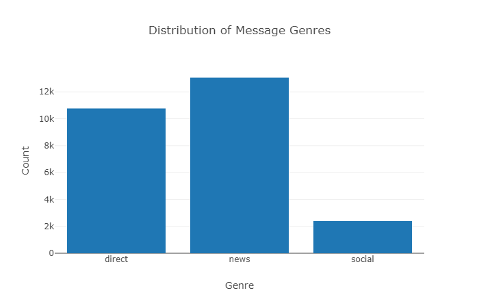
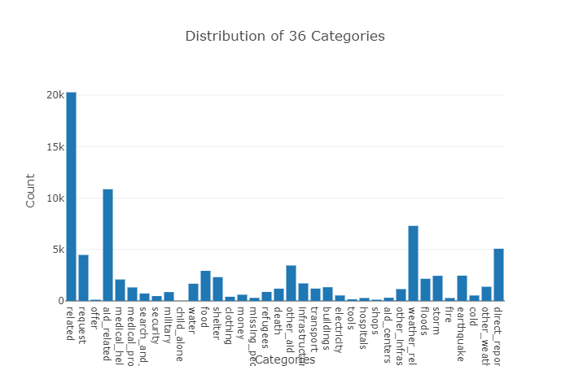
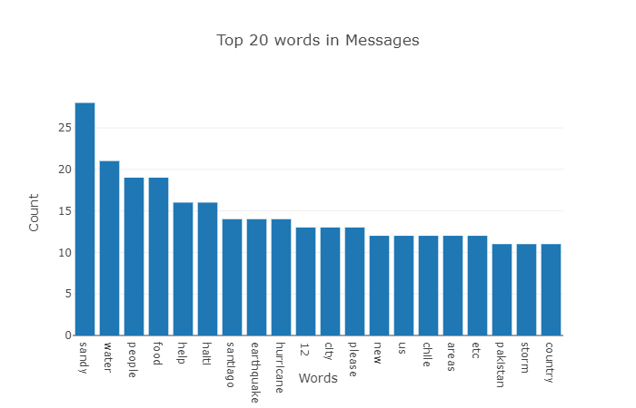

# Disaster Response Pipeline Project

## Purpose of the project:

This project attempts to analyze disaster data from Figure Eight to build a model for an API that classifies disaster messages.
The project consist of a data set that contains real messages sent during disaster events:
- disaster_messages.csv
- disaster_categories.csv
Using the above data sets, the project aims to create a machine learning pipeline to categorize these event so that these messages can be send to an 
appropriate disaster relief agency.

The project includes a web app where an emergency worker can input a new message and get classification results in several categories. The web app will also display visualizations of the data.

## Components of the project:
There are three main components of the project:

1. ETL Pipeline
The ETL pipeline is the Extract, Transform, and Load process. Here, the code reads the dataset, cleans the data, and then stores it in a SQLite database.
The ETL pipeline code is included in an ETL script: process_data.py.
The data is stored in 'DisasterResponse.db'.

2. Machine Learning Pipeline
In the machine learning pipeline, I first split the data into a training set and a test set. Then, I create a machine learning pipeline that uses NLTK, as well as scikit-learn's Pipeline and GridSearchCV to output a final model that uses the message column to predict classifications for 36 categories (multi-output classification). Finally, the model is exported to a pickle file. The machine learning code is included train_classifier.py.

3. Flask Web App
The results are displayed using a Flask web app. The Flask app uses the database file to perform visualizations and the pkl file to classify any message entered by any user in the Flask app.

## Instructions for running the pipeline:
1. Run the following commands in the project's root directory to set up your database and model.

    - To run ETL pipeline that cleans data and stores in database
        `python data/process_data.py data/disaster_messages.csv data/disaster_categories.csv data/DisasterResponse.db`
    - To run ML pipeline that trains classifier and saves
        `python models/train_classifier.py data/DisasterResponse.db models/classifier.pkl`

2. Run the following command in the app's directory to run your web app.
    `python run.py`

3. Go to http://view6914b2f4-3001.udacity-student-workspaces.com

Once at the Flask app, you can use the text box to enter any message and click 'Classify Message'. This will open another page that has the classification results from the machine learning model.

The Flask app also consists of three visualizations:

1. First visualization shows distribution of message genre.

2. Second visualization shows distribution of 36 categories in the DisasterResponse.db.

3. Third visualization shows the word frequency from the message data set after cleaning for punctuation, whitespace and stopwords.

